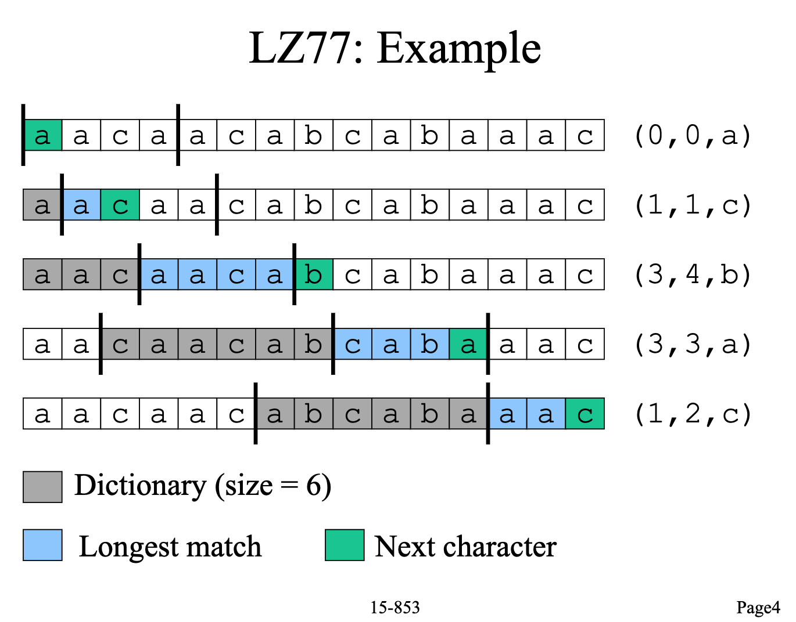

# Parallel Lossless Compressors

Huilin Xiong (hxiong)

Qier Li (qierl)


The project parallizes Huffman Coding and LZ77 compression algorithms with OpenMP, and conducts general analysis on the benchmarking and general industrial implementations.

### Brief

Compression is one of the most widely-used applications in the industry, and is developed over decades. The most recent significant variant is Facebook's zstd, which was released on 31 Agust 2016, providing great compression ratios and reasonable compress/decompress throughputs. LZ4 is also heavily used for its highest throughput among popular variants. 

Our motivation is to extremely parallelize the algorithm to improve the compress/decompress speed of one large file, which could lower the latency. Imagine the following case: transfer one large file through a fast-but-charge-by-traffic network (e.g., 5G network). Applying a parallel compression algorithm could greatly lower the latency of the process of compression and transfer, and save your pocket.

LZ77 and Huffman Coding are the 2 base algorithms repectively of Lempel-Ziv family and Entropy encoding with a long history. LZ77 is theoretically a dictionary coder, maintaining a sliding window during compression. Huffman Coding is a particular type of optimal prefix coder, representing data items with the frequencies of occurrences. Most modern compressors, such as zstd, are based on those 2 algorithms.

This project has learned and implemented this two most important lossless data-compression algorithm （sequential version), then designed and implemented parallel versions for each using OpenMP. The project further analyzed performance including compression ratio and throughput/speedups on PSC machines. By such a programming practice, the project developed some conclusions and assumptions for the parallism strategy and potentials for general compression algorithms and Facebook's zstd.


### Reference and Resource

This project heavily refers to *Mastering Algorithms with C: Useful Techniques from Sorting to Encryption*, especially implementing the sequential versions of algorithms.

The algorithms is developed to be executable and configurable with timer in **C/C++, OpenMP**, and then test on mainly two types of files, that literature such as *War and Peace* and source codes such as Angular.js. 

The tests is run on PSC machines sequentially and parallelly from num_threads 1 to 128.


### Huffman Coding


### LZ77

##### Intro

LZ77, short for Lempel-Ziv algorithm, is a lossless data-compression algorithm created by Lempel and Ziv in 1977. LZ77 has been adopted for many modern complicated algorithms such as Facebook's zstd.

##### Breakdown




​				the slide refered from 15-853 lesson

LZ77 compression process is a simple sliding-window process: from the start to the end, continually matching the longest sequence from buffer to the current window, and record the sequence in buffer as a (offset, length, ending character) tuple.

The sequential process contains the following steps (assuming the original file and encoded file could fit in memory): 

1. Read the file into memory.
2. Initialize the sliding windows and starts encoding.
3. Write the encoded content to another file.

For most storage (disk, SSD...), reading/writing will not benefit from parallism (or even worse with parallism), so step 1 and step 3 are not parallelizable.

Generally the parallelizable of the process is the step 2. And as the file size grows, the ratio of time of step 2 increases. It could be concluded that large file is more parallelizable. And a linear-speedup of compression (throughput) is expected for large files.

The strategy of parallism is to **partition consecutive parts** of original files and indicates the parallism in the headers. The pitfall for ratio/speedup is the following:

1. Partition might break a potential matched sequence and require more encoding tuples.
2. Extra padding is needed, as encoding is bit-level and partition and headers are byte-level.
3. Extra headers is needed, to indicates the number of partitions and positions. 

Above 2 pitfalls just requires a few bytes to encode, which is negligible and the following tests prove it.

##### Deliverables

A executable program is developed and configurable based on the following strategy. The decoding process is not parallelized because it is comparably fast.

Inside the path lz77/src, there's a Makefile to compile a executable file LZ77.

````bash
% ./lz77 -h
./lz77: invalid option -- 'h'
Usage: ./lz77 -f <filename>
                [-x for extract]
                [-t <number of threads, 0 for sequential>] 
````

Tag -t indicates the number of threads.

The tuple is configurable in the source file compress.h as following:

````c++
#define LZ77_TYPE_BITS   1 // indicates a matched sequence or a single character
#define LZ77_WINOFF_BITS 12 // [0, 4096]
#define LZ77_BUFLEN_BITS 5 // [0, 32]
#define LZ77_NEXT_BITS   8 // [0, 256]

#define LZ77_WINDOW_SIZE  4096 // must in [2, 2^LZ77_WINOFF_BITS]
#define LZ77_BUFFER_SIZE  32 // must in [2, 2^LZ77_BUFLEN_BITS]
````

As the window size and buffer size increases, the length of the matched sequence is likely to be longer, but it requires more bits to represent each tuple and also more time to compress. And it's highly trace-dependent. Based on the test files, the default configuration achieves a reasonable throughput and compression ratio.

##### Result


##### Analysis


### Why not GPU?

##### Memory bound

##### Algorithms are not highly parallelizable (with great number of threads)


### Comparison


Huffman analysis + parallel design, etc…	- Xiong

Huffman family’s implementation versus our simple one (e.g., 新huffman用了什么新技术/算法）- Xiong

Lz77 analysis + parallel design, etc…	- Qier

Modern lz family’s implementation versus our simple one (e.g., lz4用了什么新技术/算法）- Qier

Comparison between Huffman and lz77 - Qier

Why NOT GPU? - Qier

性能总结+zstd分析 – Qier


